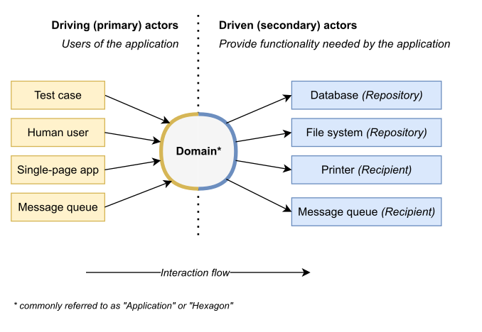

# thin-ports-and-adapters

[](https://github.com/aleixmorgadas/thin-ports-and-adapters/discussions)

### [Share your thin ports and adapters in another language or framework here! 🙌](https://github.com/aleixmorgadas/thin-ports-and-adapters/discussions/categories/thin-p-a-in-other-languages-and-frameworks)

This is an example of a Ports and Adapters (P&A for short) architecture in Java 21 and Spring Boot.

We can define a simple P&A architecture as follows:

```mermaid
graph LR
    RestControllerAdapter --> ApplicationService
    ApplicationService --> Entity
    Entity --> RepositoryPort
    RepositoryPort --> RepositorySQLAdapter
    subgraph Outside 
        RestControllerAdapter
        RepositorySQLAdapter
    end
    subgraph Inside 
        ApplicationService
        Entity
        RepositoryPort
    end
    
    PAdapter(Primary Adapter) -.-> RestControllerAdapter
    PPort(Primary Port) -.-> ApplicationService
    SAdapter(Secondary Adapter) -.-> RepositorySQLAdapter
    SPort(Secondary Port) -.-> RepositoryPort
```


[Reference](https://codesoapbox.dev/ports-adapters-aka-hexagonal-architecture-explained/)

A possible Spring Boot implementation of the adapters is:

```java
// RestControllerAdapter
@RestController
class TeamController {
    private final TeamService teamService;
    
    @GetMapping("/teams")
    public List<TeamData> getTeams() {
        return teamService.getTeams();
    }
}

// TeamRepositoryPort
interface TeamRepository extends ListCrudRepository<Team, Long> {
}

// The SQL Adapter of the TeamRepositoryPort is provided by Spring Data JPA.
```

### Is it only this?

Yes, a ports and adapters architecture is only this.

Patterns like Domain Events, Aggregates, Value Objects, CQRS and Event Sourcing, all those patters go beyond the intention or responsibility of a ports and adapters architecture. Indeed, a P&A architecture works well with CRUD models (or models with not many domain logic) as well as Domain Models.

The beauty of it is that it adapts to each part of your business, and you can choose the right amount of abstraction/complexity for each scenario.

### And testing?

IMHO, this is where a P&A shines. It really helps you create a solid and adaptable test suite. Here a short example of test types.

**End-to-end tests**

- [TeamControllerE2ETest](src/test/java/dev/aleixmorgadas/thinportsandadapters/web/TeamControllerE2ETest.java)

**Integration test**

- HTTP adapter. [TeamControllerIntegrationTest](https://github.com/aleixmorgadas/thin-ports-and-adapters/blob/main/src/test/java/dev/aleixmorgadas/thinportsandadapters/web/TeamControllerIntegrationTest.java)
- Service and SQL Repository. [TeamServiceIntegrationTest](https://github.com/aleixmorgadas/thin-ports-and-adapters/blob/main/src/test/java/dev/aleixmorgadas/thinportsandadapters/domain/TeamServiceIntegrationTest.java)
- SQL Repository. [TeamRepositoryIntegrationTest](https://github.com/aleixmorgadas/thin-ports-and-adapters/blob/main/src/test/java/dev/aleixmorgadas/thinportsandadapters/domain/TeamRepositoryIntegrationTest.java)

**Unit test**

- HTTP adapter. [TeamControllerUnitTest](https://github.com/aleixmorgadas/thin-ports-and-adapters/blob/main/src/test/java/dev/aleixmorgadas/thinportsandadapters/web/TeamControllerUnitTest.java)
- Service. [TeamServiceTest](https://github.com/aleixmorgadas/thin-ports-and-adapters/blob/main/src/test/java/dev/aleixmorgadas/thinportsandadapters/domain/TeamServiceTest.java)
- Domain. [TeamTest](https://github.com/aleixmorgadas/thin-ports-and-adapters/blob/main/src/test/java/dev/aleixmorgadas/thinportsandadapters/domain/TeamTest.java)

## Running the application

```shell
./gradlew bootTestRun
```

ℹ️ It uses [Spring Boot integration][sbit] with Testcontainers to spin up a PostgreSQL container.

### Using the API

```shell
curl -X GET http://localhost:8080/teams
``` 

```shell
curl -X POST -H "Content-Type: application/json" -d '{"name": "Team 1"}' http://localhost:8080/teams
```

```shell
curl -X PATCH -H "Content-Type: application/json" -d '{"name": "Team 1"}' http://localhost:8080/teams/{id}/rename
```

## Running the tests

```shell
./gradlew test
```

You will see how the thin ports and adapters architecture allows us to test the application with multiple approaches:

- Unit tests for the domain logic.
- Integration tests for the application service.
- End-to-end tests for the REST API.

[sbit]: https://spring.io/blog/2023/06/23/improved-testcontainers-support-in-spring-boot-3-1
